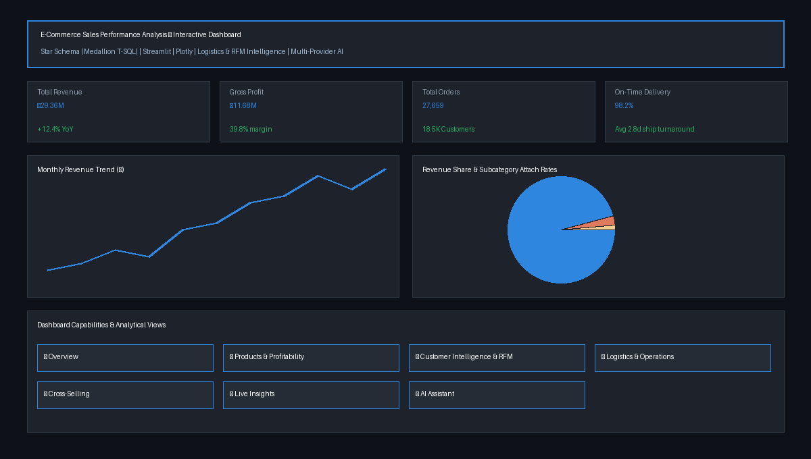

# 📊 E-Commerce Sales Performance Analysis

<p align="left">
  <a href="https://github.com/Vikrant038/E-Commerce-Sales-Performance-Analysis/actions/workflows/ci.yml"></a>
  
  
  
  
  
  
  
  
  
</p>

**Turn raw e-commerce data into decisions.** This project takes raw CRM/ERP sales extracts, cleans them into a star schema, and serves the result as an **interactive dashboard** anyone can use — no SQL required. It features deep analytics on product margins, customer RFM segmentation, logistics fulfillment, market basket cross-selling, and answers plain-English questions via an optional **conversational AI assistant**.

🔗 **Live demo:** [Streamlit Cloud App](https://e-commerce-sales-performance-analysis.streamlit.app/) · 🎥 **Walkthrough:** [Interactive Case Study](docs/INSIGHTS.md)



---

## The problem
~27,700 orders, 18,500 customers and 296 products lived in six raw source tables. Useful, but unusable: no one could quickly answer *where revenue comes from, which categories have true profit margin, how fulfillment is performing, or how to lift attach rates.*

## What it does
- **Cleans & models the data** into a tidy star schema — a complete Medallion (Bronze → Silver → Gold) pipeline with **T-SQL DDL & stored procedures** (`scripts/`) **and Python** (`src/clean.py`, reproducing all 5 Gold artifacts).
- **Executive Dashboard** with live KPIs (revenue, **gross profit & margin**, orders, customers, AOV, on-time delivery %, dispatch turnaround) and multi-dimensional filters.
- **Seven comprehensive analytical views:**
  1. 📈 **Overview:** Monthly revenue trend, annual YoY growth, category donut mix, new vs returning buyers.
  2. 📦 **Products & Profitability:** Volume vs Margin % scatter plot, top products, subcategory rankings, cost segmentation.
  3. 👥 **Customer Intelligence:** Dynamic RFM customer scoring, world revenue choropleth map, cohort retention matrix.
  4. 🚚 **Logistics & Operations:** On-time fulfillment gauge, delivery delay distribution, shipping turnaround.
  5. 🛒 **Cross-Selling & Basket:** Co-purchase pairing attach rates and multi-item order penetration.
  6. 💡 **Actionable Insights:** Dynamic headline metrics paired with strategic next actions.
  7. 🤖 **Ask the Data (AI Assistant):** Conversational chat interface with message memory, streaming responses, and instant executive summaries.
- **Multi-Format Export:** Download filtered slices as **CSV** or complete multi-tab **Excel workbooks (`.xlsx`)**.

## 💡 Key Insights (each with a "so what")
1. **Revenue is concentrated:** Bikes drive **96.5%** of revenue — concentration risk + diversification need.
2. **Profit hides in small categories:** Accessories earn a **62.8% margin** (vs 39% on bikes) but are only 2.4% of sales → push attach-sales.
3. **Repeat customers carry the business:** **37% of buyers generate 77% of revenue** → retention beats acquisition.
4. **The 2013 boom was returning buyers:** **64%** of the peak-year revenue came from repeat customers → protect the flywheel.
5. **Two markets dominate:** **US + Australia ≈ 62%** of revenue; UK, Germany, France split the rest.
6. **High fulfillment reliability:** **98.2% on-time shipping rate** with an average turnaround of **2.8 days**.
7. **Cross-sell attach rate:** Helmets and Bottle Cages represent the highest-frequency co-purchase pairing (>20% attach rate with bikes).

Headline: **€29.4M revenue · €11.7M profit · 39.8% margin · €1,061 AOV.** → Full case study in [`docs/INSIGHTS.md`](docs/INSIGHTS.md).

---

## ▶️ Run it locally

```bash
# from this folder
python3 -m venv .venv
source .venv/bin/activate          # Windows: .venv\Scripts\activate
pip install -r requirements.txt
streamlit run streamlit_app.py     # opens http://localhost:8501
```

### 🐳 Run with Docker
```bash
docker compose up --build          # opens http://localhost:8501
```

---

## 🤖 Enable the AI assistant (optional, multi-provider)
The dashboard works fully without it. To enable the **Ask the data** chat tab, add **any one** provider key to `.streamlit/secrets.toml` or `.env`:
```toml
ANTHROPIC_API_KEY = "sk-ant-..."   # or OPENAI_API_KEY = "sk-..." or GEMINI_API_KEY = "AIza..."
```
The assistant receives **only an aggregated snapshot** of the current view (never raw customer records/PII), has a request timeout, and is capped per session to control cost.

---

## 🧪 Tests & Quality Assurance
```bash
pip install -r requirements-dev.txt
pytest -v                          # 72 tests: unit, data quality, KPIs, charts, headless AppTest, cleaning ETL
ruff check .                       # linter & style enforcement
```
Every push runs the full suite via GitHub Actions CI (badge above).

---

## 🧱 Architecture & Project Structure
```
datasets/        Bronze (raw) → Silver (cleaned) → Gold (star schema + reports) CSV exports
scripts/
  00_init_database.sql           DDL schema creation & BULK INSERT seeding
  etl/                           T-SQL stored procedures (Bronze->Silver->Gold)
  01-12_*.sql                    12 T-SQL analytical & reporting scripts
  13_logistics_and_shipping.sql  Logistics fulfillment & turnaround SQL
  14_market_basket_analysis.sql  Co-purchase affinity & cross-sell SQL
streamlit_app.py Dashboard entry point (7 interactive tabs)
src/
  data.py        Cached loaders, dynamic RFM, market basket, logistics calculations
  clean.py       Python Bronze→Silver→Gold ETL pipeline (reproduces all 5 Gold CSVs)
  insights.py    Live KPIs + action-oriented insight engines
  charts.py      19 Plotly figure builders (scatter, choropleth, cohort heatmap, gauge)
  llm.py / ai.py Multi-provider LLM client + PII-free aggregated context chat layer
tests/           72 pytest tests (data quality, charts, ETL regression, headless AppTest)
Dockerfile       Containerized deployment
docker-compose.yml Zero-dependency local orchestration
```

**Tech:** T-SQL (Microsoft SQL Server / Medallion Architecture) · Python 3.12 · pandas · Streamlit · Plotly · openpyxl · Anthropic / OpenAI / Gemini · Docker · pytest + GitHub Actions.

---

## 🌟 About Me
Hi! I'm **Vikrant Yadav** — I build AI automation & data systems for businesses. On a mission to make working with data enjoyable and engaging.

[](https://www.linkedin.com/in/vikrant-ydata/)
